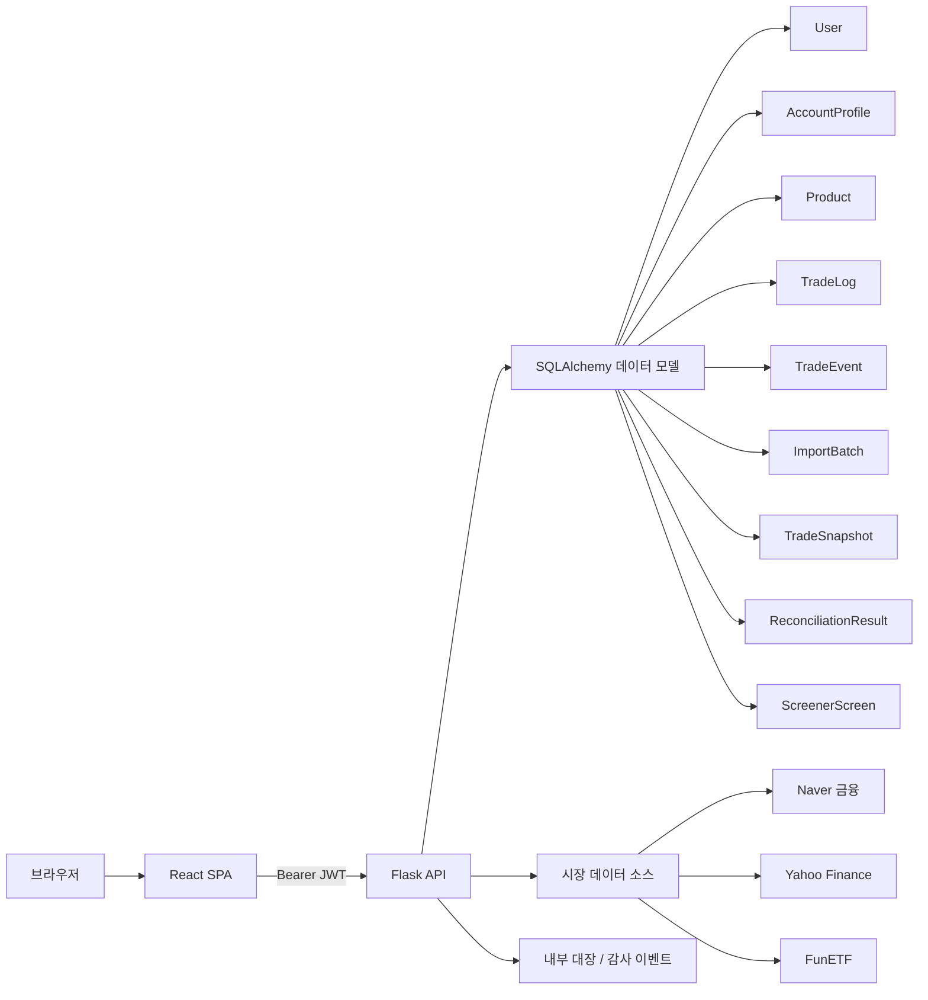
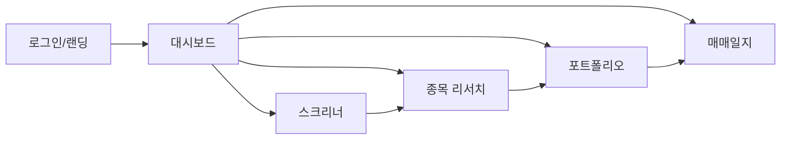

# 자산관리 대장 웹앱과 저장소 심층 진단

## 요약

이번 점검 기준으로 보면, 이 프로젝트는 “단순 포트폴리오 기록기” 단계는 이미 넘었습니다. 2026-04-28에 반영된 정렬 커밋 기준으로 연금 계좌 카테고리 구분, 연금 적격성 판정, 데이터 출처·신선도 배지, 매매일지 감사 이력과 export, 랜딩 페이지와 브랜딩 정비가 한꺼번에 들어왔고, 현재 `models.py`에는 감사·수입배치·스냅샷·대사·스크리너 저장을 위한 도메인 모델까지 확장돼 있습니다. 즉, “보고서 일부 반영”이 아니라 핵심 권고 축 두세 개는 이미 제대로 코드에 녹아 있습니다. fileciteturn51file0L1-L1 fileciteturn55file0L1-L1

다만 아직 “주식 + 퇴직연금 + IRP + 매매일지 + 스크리너 + 분석”을 완전히 하나의 운영 시스템처럼 쓰기에는 빈칸이 남아 있습니다. 특히 **수집/대사(import/reconciliation) UX**, **성과기여도·현금드래그·TWR/MWR 같은 분석 심화**, **스크리너 → 리서치 → 대장 입력/매매 의사결정으로 이어지는 연결성**, **모바일 퍼스트 반응형 마감도**는 아직 구조가 준비된 수준이거나 부분 구현 단계로 보입니다. fileciteturn51file0L1-L1 fileciteturn55file0L1-L1

운영 상태는 저장소 내 체크리스트상 “백엔드 부팅 오류 수정 배포”와 “운영 접속 재확인”이 완료 처리되어 있고, 백엔드 헬스체크 200도 기록돼 있습니다. 다만 제 도구로는 자바스크립트 기반 SPA 로그인 폼 제출과 로그인 후 실제 데이터 로드를 독립적으로 재현할 수 없어서, **사용자 제공 계정(ID: 김정규 / PW: 854854)으로 로그인 성공 여부와 데이터 표시 여부는 직접 검증하지 못했습니다**. 라이브 앱에서 제가 직접 확인한 것은 루트 페이지 제목과 “JavaScript 필요” 응답까지입니다. fileciteturn52file0L1-L1 citeturn8view0

제 결론은 명확합니다. **지금 가장 중요한 건 새 기능을 더 늘리는 것보다, 이미 들어온 기능들을 하나의 운영 플로우로 묶고, import/대사/분석 심화를 통해 “만능 프로그램”의 마지막 30%를 채우는 것**입니다. 아래에 바로 Codex에 넣을 수 있는 형태로 우선순위와 프롬프트를 정리했습니다. fileciteturn51file0L1-L1

## 검토 범위와 확인 상태

이번 분석은 먼저 entity["company","GitHub","developer platform"] 커넥터로 저장소를 확인한 뒤, 라이브 앱 루트 응답과 저장소의 최근 커밋·체크리스트를 교차해 정리했습니다. 루트 앱은 entity["company","Vercel","cloud platform"] 에 배포된 SPA이고, 저장소 체크리스트는 백엔드가 entity["company","Railway","cloud platform"] 에서 복구되었다고 기록합니다. 이 조합은 프런트와 백을 분리 운영하는 구조로 읽히며, 현재 보고서 반영도 판단에는 충분한 근거를 제공합니다. fileciteturn51file0L1-L1 fileciteturn52file0L1-L1 citeturn8view0

| 점검 항목 | 확인 결과 | 해석 |
|---|---|---|
| 라이브 앱 루트 | 제목이 **자산관리 대장**으로 표시되고 JavaScript 의존 SPA 응답 확인 | 브랜딩/퍼블릭 진입점은 반영됨 |
| 핵심 최근 커밋 | 2026-04-28 기준 eligibility, audit, data badge 관련 대규모 반영 | 보고서 핵심 권고가 실제 코드에 반영됨 |
| 운영 체크리스트 | 백엔드 부팅 오류 수정 배포와 운영 재확인 완료 처리 | 최소한 운영 복구는 진행된 상태로 보임 |
| 인증/데이터 로드 | 도구 한계로 실제 로그인 POST 및 로그인 후 화면 검증 불가 | 로컬/Playwright 기반 재검증 필요 |

검토한 주요 파일은 다음과 같습니다. 리포지토리 전체를 트리 덤프로 본 것은 아니지만, 실제 동작과 보고서 반영 여부를 판단하는 데 필요한 핵심 파일은 폭넓게 확인했습니다. 근거 파일은 최근 정렬 커밋, 운영 체크리스트, 현재 `backend/models.py`입니다. fileciteturn51file0L1-L1 fileciteturn52file0L1-L1 fileciteturn55file0L1-L1

| 레이어 | 검토 파일 |
|---|---|
| 배포/운영 | `vercel.json`, `frontend/vercel.json`, `docs/report-checklist.md` |
| 백엔드 앱 | `backend/app.py`, `backend/models.py`, `backend/routes.py`, `backend/api_client.py`, `backend/scheduler.py`, `backend/requirements.txt` |
| 프런트 엔트리 | `frontend/package.json`, `frontend/src/App.js`, `frontend/src/utils/api.js` |
| 페이지 | `Dashboard.jsx`, `Portfolio.jsx`, `TradeLog.jsx`, `StockResearch.jsx`, `StockScreener.jsx`, `Login.jsx`, `Landing.jsx` |
| 컴포넌트/라이브러리 | `Navigation.jsx`, `AccountSelector.jsx`, `StockResearchPanel.jsx`, `AnalyticsDashboard.jsx`, `DataBadge.jsx`, `frontend/src/lib/analytics/*`, `pensionEligibility.js`, `sourceRegistry.js` |
| 스타일 | `Dashboard.css`, `Portfolio.css`, `TradeLog.css`, `StockResearch.css`, `Analytics.css`, `Landing.css`, `DataBadge.css` |

로그인 검증 상태는 분명히 적어두겠습니다. **제가 직접 로그인과 데이터 로드를 검증한 것은 아닙니다.** 이유는 현재 사용 가능한 브라우징 도구가 자바스크립트로 렌더링되는 로그인 화면에서 입력·제출·세션 유지·XHR 결과 확인까지 수행하지 못하기 때문입니다. 대신 저장소 체크리스트에는 운영 복구와 헬스체크 성공이 기록돼 있습니다. fileciteturn52file0L1-L1 citeturn8view0

## 아키텍처와 구현 현황

현재 구조는 React SPA 프런트와 Flask API 백엔드를 분리한 형태로 이해하는 것이 가장 자연스럽습니다. 최근 커밋에는 라우터 기반 랜딩/대시보드/포트폴리오/매매일지/리서치/스크리너 구성이 보이고, 백엔드에는 `Flask`, `JWTManager`, `SQLAlchemy`, 다수의 `@jwt_required()` API, 계좌/상품/매매일지/이벤트 모델이 존재합니다. 또한 배포 설정은 Vercel 정적 빌드와 헤더 설정 중심이고, 운영 체크리스트는 Railway 백엔드 복구를 별도로 기록합니다. fileciteturn51file0L1-L1 fileciteturn52file0L1-L1



도메인 설계는 생각보다 많이 진척돼 있습니다. `AccountProfile`에 `account_type`뿐 아니라 `account_category`가 추가되어 일반과세/연금저축/IRP/DC/DB 참조를 구분하고, `TradeEvent`는 append-only 체인 형태로 `prev_hash`, `hash`, `supersedes_event_id`를 저장합니다. 더 나아가 현재 `models.py`에는 `ImportBatch`, `TradeSnapshot`, `ReconciliationResult`, `ScreenerScreen`까지 정의돼 있어서, **수집·감사·대사·스크리너 저장**을 위한 백엔드 골격은 이미 형성된 상태입니다. 최근 운영 장애였던 `AmbiguousForeignKeysError`도 현재 `User.trade_events`와 `created_trade_events`를 `foreign_keys`로 분리하는 방식으로 정리돼 있습니다. fileciteturn55file0L1-L1

보고서 반영 관점에서 가장 눈에 띄는 부분은 세 가지입니다. 첫째, **연금 적격성 계층**입니다. `pensionEligibility.js`는 계좌 유형과 계좌 카테고리를 기준으로 상품을 분류하고, `Portfolio.jsx`, `Dashboard.jsx`, `StockResearchPanel.jsx`에서 규칙 점검·적격성 미리보기·보유 자산 배지를 실제 UI에 노출합니다. 둘째, **데이터 투명성 계층**입니다. `sourceRegistry.js`와 `DataBadge.jsx`는 시세 출처와 신선도(20분 지연, 일별 마감, 내부 대장 등)를 표시하고, 서로 다른 주기의 데이터가 섞이면 경고를 띄우도록 설계돼 있습니다. 셋째, **감사 이력 계층**입니다. `TradeLog.jsx`는 감사 이력 패널과 JSON/CSV/PDF export 버튼을 갖고 있고, `backend/routes.py`는 `/trade-logs/audit`와 export 엔드포인트를 가지고 있습니다. fileciteturn51file0L1-L1

데이터 소스 설계도 방향은 맞습니다. 코드상 소스 레지스트리에는 entity["company","Naver","internet company"] 금융, entity["company","Yahoo","internet company"] Finance, FunETF, 내부 대장, 스크리너, entity["organization","Open DART","korean filings"] 이 등록되어 있고, 백엔드 quote 스냅샷은 소스명과 freshness class를 JSON에 실어 보냅니다. 다만 여기서 중요한 약점 하나도 같이 보입니다. **현재 적격성 판정과 일부 상품 분류는 이름/키워드/코드 패턴 기반 휴리스틱에 많이 의존**합니다. 이 설계는 MVP로는 좋지만, 만능 운영도구 단계에서는 오분류 비용이 커집니다. fileciteturn51file0L1-L1

라이브 앱 자체는 공개 진입점 측면에서 분명히 좋아졌습니다. 루트 응답은 “자산관리 대장” 타이틀과 한국어 noscript 문구를 반환하고, 최근 커밋은 `Landing.jsx`를 추가해 비로그인 상태에서도 제품 목적과 핵심 기능을 설명하도록 바꿨습니다. 하지만 여전히 HTML 응답만으로는 실제 UI를 볼 수 없을 만큼 JS 의존도가 높아서, 정확한 레이아웃/간격/콘텐츠 계층의 완성도는 스크린샷 기반 재검토가 필요합니다. citeturn8view0 fileciteturn51file0L1-L1

## 보고서 반영도와 약점

핵심 결론부터 말하면, **최근 반영분은 “보고서의 핵심 권고 중 절반 이상이 실제 동작 구조로 옮겨진 상태”**입니다. 특히 연금 적격성, 데이터 신선도 표시, 감사 이력, 랜딩 카피/브랜딩은 코드 반영이 분명합니다. 반면 “만능 프로그램”의 완성도를 좌우하는 import/reconciliation, attribution analytics, 화면 간 연결성은 아직 약합니다. fileciteturn51file0L1-L1 fileciteturn55file0L1-L1

| 영역 | 현재 상태 | 잘한 점 | 부족한 점 | 우선순위 |
|---|---|---|---|---|
| 진입 UX | 랜딩 페이지 반영 | 제품 목적과 기능 설명 명확 | JS 의존이 높아 실제 렌더링 전까지 내용 노출 한계 | 중간 |
| 계좌/연금 구분 | `account_category` 도입 | 일반과세/연금저축/IRP/DC 분리 가능 | 규칙 엔진이 휴리스틱 위주 | 높음 |
| 포트폴리오 점검 | 적격성 점검, 배지, 추이 경고 반영 | 계좌 문맥에 맞춘 해석 시작 | 성과 기여도·현금드래그·리밸런싱 액션 부족 | 매우 높음 |
| 매매일지 | append-only audit 및 export 반영 | 생성/수정/삭제 추적 가능 | diff 보기, 복원, import 연동 부족 | 매우 높음 |
| 데이터 출처 | source/freshness 표시 반영 | 사용자 신뢰를 높이는 좋은 방향 | source conflict, fallback, refresh SLA 문서화 부족 | 높음 |
| 종목 탐색 | 리서치/스크리너 구조 존재 | 계좌 문맥과 일부 연결 | 스크리너 결과를 실제 매매/포트폴리오 의사결정으로 연결하는 흐름 약함 | 높음 |
| 수집/대사 | 백엔드 모델은 준비됨 | 구조적 확장성 확보 | 사용자가 쓰는 import center가 사실상 비어 있음 | 매우 높음 |
| 반응형 | CSS 패치 다수 반영 | 카드/배지/패널별 모바일 보정 시작 | 페이지별 편차 크고 테이블 의존 여전 | 높음 |

여기서 가장 중요한 진단은 이렇습니다. **지금 코드베이스는 “새 기능을 붙일 수 없는 상태”가 아니라, 오히려 “붙여 놓은 구조를 사용자 플로우로 마감하지 못한 상태”**입니다. 따라서 다음 개발 라운드의 목표는 기능 추가 수가 아니라, **완결된 흐름 수를 늘리는 것**이어야 합니다. 예를 들어 “스크리너에서 후보 선택 → 리서치 → 연금 적격성 확인 → 포트폴리오 초안 반영 → 매수/매매일지 기록 → 감사 이력 확인” 같은 한 줄 플로우가 완성되어야 합니다. fileciteturn51file0L1-L1

## 우선순위 개선안과 Codex 가이드

아래 개선안은 **현재 구조를 최대한 살리면서** 빈칸을 메우는 순서로 잡았습니다. 각 항목마다 왜 해야 하는지, 어디를 바꿔야 하는지, 어떤 형태로 구현하면 되는지, 그리고 Codex에 그대로 넣을 수 있는 프롬프트를 적었습니다.

| 우선순위 | 개선안 | 바꿀 핵심 파일/컴포넌트 | 기대 효과 | 노력 | 위험 |
|---|---|---|---|---|---|
| 최상 | Import Center와 대사 흐름 완성 | `backend/routes.py`, `backend/models.py`, `frontend/src/utils/api.js`, 신규 `ImportCenter.jsx` | 수기 입력 의존을 줄이고 “만능 프로그램”에 가까워짐 | 높음 | 중간 |
| 최상 | Analytics v2 | `frontend/src/lib/analytics/engine.js`, `AnalyticsDashboard.jsx`, `Dashboard.jsx` | 성과 해석의 깊이가 달라짐 | 높음 | 중간 |
| 높음 | Audit timeline의 실사용화 | `TradeLog.jsx`, `backend/routes.py`, 신규 diff 컴포넌트 | 기록 신뢰성과 추적성이 크게 올라감 | 중간 | 낮음 |
| 높음 | 스크리너/리서치/대장 연결 | `StockScreener.jsx`, `StockResearchPanel.jsx`, `Portfolio.jsx` | 실제 의사결정 플로우 완성 | 중간 | 낮음 |
| 높음 | 공통 앱 셸/반응형 정리 | `App.js`, `Navigation.jsx`, 각 page CSS | 사용성이 체감 개선 | 중간 | 낮음 |
| 높음 | 운영 검증 자동화 | Playwright e2e, 배포 문서, health banner | 로그인/데이터 표시 문제를 재발 전에 잡음 | 낮음~중간 | 낮음 |

현재 백엔드에는 import/reconciliation 관련 모델이 이미 존재하고, 프런트에는 audit·eligibility·source badge 같은 운영 UI가 들어와 있습니다. 그러므로 가장 효율적인 다음 단계는 **새 테이블을 더 만드는 것보다 Import Center를 화면으로 열고, analytics를 더 깊게 만들고, audit을 실제 복구 가능한 timeline으로 바꾸는 것**입니다. fileciteturn55file0L1-L1 fileciteturn51file0L1-L1

### Import Center와 대사 흐름 완성

현재 `ImportBatch`, `TradeSnapshot`, `ReconciliationResult`는 모델에 존재하지만, 사용자가 파일을 올리고 preview → commit → mismatch 확인까지 가는 전면 플로우는 눈에 띄지 않습니다. 이건 구조 대비 UX가 가장 뒤처진 부분입니다. fileciteturn55file0L1-L1

**권장 변경 위치**
- `backend/routes.py`의 계좌/매매일지 API 옆에 `POST /api/imports/preview`, `POST /api/imports/commit`, `GET /api/reconciliation/latest`
- `frontend/src/utils/api.js`에 `importAPI`
- 신규 `frontend/src/pages/ImportCenter.jsx`
- `TradeLog.jsx` 또는 `Portfolio.jsx` 상단에 “파일 불러오기” CTA

```python
@api.route('/imports/preview', methods=['POST'])
@jwt_required()
def preview_import():
    file = request.files['file']
    source_name = request.form.get('source_name', 'broker_csv')
    rows = parse_trade_file(file, source_name)
    normalized_rows = normalize_rows(rows)
    preview = build_reconciliation_preview(
        user_id=current_user_id(),
        account_name=current_account_name(),
        rows=normalized_rows
    )
    batch = create_import_batch(status='preview', row_count=len(normalized_rows))
    return jsonify({
        'batch_id': batch.id,
        'preview': preview.summary,
        'rows': preview.rows[:200],
        'mismatches': preview.mismatches
    })
```

```text
Codex prompt
이 저장소에서 ImportBatch, TradeSnapshot, ReconciliationResult 모델을 실제 사용자 플로우로 연결해줘.

요구사항:
1) backend/routes.py에 아래 엔드포인트를 추가:
   - POST /api/imports/preview
   - POST /api/imports/commit
   - GET /api/reconciliation/latest
2) CSV 업로드 기준으로 preview 단계에서
   - 행 파싱
   - 표준 필드 정규화
   - 기존 TradeLog/Product와 대사
   - 신규/중복/충돌/무시 건수 요약
   를 반환하게 해줘.
3) commit 단계에서 ImportBatch, TradeEvent, TradeSnapshot, ReconciliationResult를 함께 기록해줘.
4) frontend/src/utils/api.js에 importAPI를 추가하고,
   frontend/src/pages/ImportCenter.jsx를 새로 만들어
   파일 선택 → preview 테이블 → commit 결과 → mismatch 패널
   흐름을 구현해줘.
5) Navigation 또는 TradeLog 상단에 Import Center 진입 버튼을 추가해줘.
6) 변경 후 수동 테스트 절차와 예시 CSV 포맷도 docs/report-checklist.md에 적어줘.

출력 형식:
- 수정 파일 목록
- 핵심 diff 요약
- 테스트 절차
```

### Analytics v2

현재 분석 쪽은 엔진과 리포트 export가 있고, 최근 반영은 주로 eligibility 패널과 data badge/freshness 경고 쪽에 집중돼 있습니다. 즉 “보여주는 것”은 좋아졌지만, “해석의 깊이”는 아직 부족합니다. 여기선 **TWR/MWR, 초과수익 분해, 현금 비중 영향, 매수/매도 이벤트별 성과 기여도**가 핵심입니다. fileciteturn51file0L1-L1

**권장 변경 위치**
- `frontend/src/lib/analytics/engine.js`
- `frontend/src/lib/analytics/adapters.js`
- `frontend/src/components/analytics/AnalyticsDashboard.jsx`
- `frontend/src/pages/Dashboard.jsx`
- 필요 시 백엔드에 계좌별 일자 시계열 endpoint 추가

```javascript
export function computeAttribution({ dailySeries, benchmarkSeries, cashFlows }) {
  const twr = computeTimeWeightedReturn(dailySeries, cashFlows);
  const mwr = computeXirr(cashFlows);
  const active = twr - computeBenchmarkReturn(benchmarkSeries);
  const allocationEffect = computeAllocationEffect(dailySeries, benchmarkSeries);
  const selectionEffect = active - allocationEffect;
  const cashDrag = computeCashDrag(dailySeries);

  return {
    twr,
    mwr,
    active,
    allocationEffect,
    selectionEffect,
    cashDrag
  };
}
```

```text
Codex prompt
현재 analytics 엔진에 성과기여도 분석을 추가해줘.

해야 할 일:
1) frontend/src/lib/analytics/engine.js를 확장해서
   - TWR
   - MWR(XIRR)
   - benchmark 대비 초과수익
   - allocation effect
   - selection effect
   - cash drag
   를 계산하게 해줘.
2) Dashboard와 AnalyticsDashboard에
   - KPI 카드
   - attribution waterfall
   - period table
   - worst drawdown intervals
   UI를 추가해줘.
3) 기존 export report HTML에도 위 지표를 포함시켜줘.
4) 계산이 어려운 부분은 pure function으로 분리하고 unit test를 만들어줘.
5) 숫자 포맷은 ko-KR 기준, 음수/양수 색상은 기존 스타일을 재사용해줘.

출력:
- 수정된 함수 목록
- 새로 추가된 차트/테이블 목록
- 테스트 케이스 설명
```

### Audit timeline의 실사용화

지금 감사 이력은 이미 가치가 큽니다. 다만 현재 화면은 “요약 카드 + 목록 + export”에 가깝습니다. 실전에서는 **어떤 필드가 어떻게 바뀌었는지**, **수정 전후 포지션이 무엇이었는지**, **삭제된 로그를 복구할 수 있는지**가 훨씬 중요합니다. fileciteturn51file0L1-L1

**권장 변경 위치**
- `backend/routes.py`의 `append_trade_event`, `get_trade_log_audit`, `update_trade_log`, `delete_trade_log`
- `frontend/src/pages/TradeLog.jsx`
- 신규 `AuditEventDiff.jsx`, `AuditRestoreModal.jsx`

```jsx
<AuditEventDiff
  before={event.payload?.before}
  after={event.payload?.after}
  deleted={event.payload?.deleted}
  hash={event.hash_short}
  occurredAt={event.occurred_at}
/>
```

```text
Codex prompt
매매일지 감사 이력을 ‘읽을 수 있는 timeline’으로 바꿔줘.

구현 요구:
1) TradeLog.jsx에서 감사 이력 목록을 카드형 timeline으로 재구성해줘.
2) 각 이벤트에서
   - 변경 전 / 변경 후 diff
   - 상품명, 거래유형, 수량, 단가, 총액
   - hash 체인 정보
   를 펼침 패널에서 볼 수 있게 해줘.
3) backend/routes.py에
   - 특정 이벤트 상세 조회
   - 특정 trade_log_id의 전체 이벤트 연혁 조회
   를 보강해줘.
4) 삭제 이벤트에 대해서는 ‘복원 초안 만들기’ 기능을 추가하되,
   실제 복원은 새 이벤트를 append하는 방식으로 구현해줘.
5) PDF export는 현재 유지하되,
   UI에서는 JSON/CSV를 우선 추천하고 명세 설명을 붙여줘.

마지막에:
- 사용자 시나리오 3개
- 수동 테스트 절차
를 출력해줘.
```

### 스크리너/리서치/대장 연결

지금 구조를 보면 리서치와 스크리너는 이미 존재하고, 리서치 패널도 꽤 풍부합니다. 다만 여전히 페이지가 분리돼 있어서 사용자는 “찾고 → 보고 → 바로 반영”까지 한 번에 가기 어렵습니다. 이 부분이 붙으면 체감 완성도가 크게 올라갑니다. fileciteturn51file0L1-L1

**권장 변경 위치**
- `frontend/src/pages/StockScreener.jsx`
- `frontend/src/components/StockResearchPanel.jsx`
- `frontend/src/pages/Portfolio.jsx`
- `backend/models.py`의 `ScreenerScreen`
- 관련 save/load routes

```javascript
function useCandidateBridge(candidate) {
  return {
    openResearch: () => navigate('/stock-research', { state: { prefillProduct: candidate } }),
    stageToPortfolio: () => navigate('/portfolio', { state: { draftProduct: candidate } }),
    setBenchmark: () => setBenchmarkSelection(candidate)
  };
}
```

```text
Codex prompt
Stock Screener, Stock Research, Portfolio 입력 화면을 하나의 의사결정 플로우로 연결해줘.

요구사항:
1) 스크리너 결과 카드에 아래 액션을 추가:
   - 리서치 열기
   - benchmark로 사용
   - 포트폴리오 입력 초안 만들기
2) StockResearchPanel에서 선택 종목을 바로
   Portfolio 입력 초안으로 넘길 수 있게 해줘.
3) backend/models.py의 ScreenerScreen을 활용해서
   사용자별 저장 스크린/불러오기 기능을 붙여줘.
4) compare 후보는 최대 5개까지 저장하고,
   benchmark preset과 별도로 관리해줘.
5) 연금 계좌일 때는 적격성 상태를 결과 카드 상단 배지로 더 강하게 보여줘.

출력:
- 새 사용자 플로우 설명
- 수정 파일
- 저장/불러오기 API 명세
```

### 공통 앱 셸과 반응형 마감

랜딩, 배지, 적격성 카드, 감사 패널이 각각 좋아졌지만, 여전히 페이지마다 밀도 차이가 있습니다. 특히 모바일에서는 페이지마다 “잘된 구역”과 “구식 테이블 구역”이 섞여 보일 가능성이 큽니다. 여기선 **공통 app shell, global search, mobile card mode, sticky action bar**가 중요합니다. 라이브 루트가 JS 의존 SPA인 만큼, 화면 뼈대의 안정감이 더 중요합니다. citeturn8view0 fileciteturn51file0L1-L1



```text
Codex prompt
이 프로젝트의 UI를 기능 추가보다 ‘운영 화면’처럼 보이도록 정리해줘.

목표:
1) App.js와 Navigation을 기준으로 공통 AppShell을 만들고
   - 상단 global search
   - 좌측/상단 네비게이션 일관화
   - 페이지 타이틀/설명/주요 액션 영역 통일
   구조를 적용해줘.
2) Portfolio, TradeLog, Dashboard의 주요 테이블/리스트를
   768px 이하에서 mobile card mode로 전환해줘.
3) 핵심 CTA(상품 추가, export, import, 리서치 이동)는 sticky action bar로 묶어줘.
4) 페이지별 spacing, panel radius, heading scale을 토큰화해서 정리해줘.
5) 작업 후 desktop/mobile 대표 스크린샷을 Playwright로 자동 저장하게 해줘.

출력:
- 디자인 토큰 변경 요약
- 화면별 before/after 포인트
- 생성된 스크린샷 파일 경로
```

### 로그인과 데이터 로드 검증 자동화

이건 반드시 하셔야 합니다. 저장소 체크리스트는 운영 복구를 말해 주지만, 실제 사용자는 “로그인돼서 데이터가 보이느냐”만 봅니다. 그래서 다음 라운드 첫 작업은 기능 추가가 아니라 **Playwright smoke test**여야 합니다. 현재 도구로는 제가 이 검증을 대신할 수 없습니다. fileciteturn52file0L1-L1 citeturn8view0

```ts
import { test, expect } from '@playwright/test';

test('prod login smoke', async ({ page }) => {
  await page.goto('https://retirement-portfolio-omega.vercel.app/login');
  await page.getByLabel(/아이디|사용자명|username/i).fill('김정규');
  await page.getByLabel(/비밀번호|password/i).fill('854854');
  await page.getByRole('button', { name: /로그인|sign in/i }).click();
  await page.waitForLoadState('networkidle');

  await expect(
    page.locator('text=/총 평가액|원금|포트폴리오|매매일지/i').first()
  ).toBeVisible();

  await page.screenshot({ path: 'artifacts/prod-login-dashboard.png', fullPage: true });
});
```

```text
Codex prompt
이 저장소에 production smoke test를 추가해줘. 목적은 ‘로그인 성공 + 데이터 표시 여부’를 재현 가능하게 검증하는 것이다.

세부 요구:
1) Playwright 설정을 추가하고 npm script를 만든다.
2) 아래 계정으로 production login smoke test를 만든다.
   - ID: 김정규
   - password: 854854
3) 테스트는 다음을 확인해야 한다.
   - 로그인 폼 제출 성공 여부
   - 로그인 후 dashboard/portfolio/trade-log 중 하나의 핵심 데이터 카드 노출 여부
   - 실패 시 콘솔 오류, 네트워크 오류, 응답 코드, 스크린샷 저장
4) 성공/실패와 무관하게 screenshot, HAR, console log를 artifacts 폴더에 저장한다.
5) 셀렉터가 다르면 DOM을 먼저 읽고 resilient selector로 구현한다.
6) README 또는 docs/report-checklist.md에 실행 명령을 적어준다.

마지막 출력:
- 추가된 파일
- 실행 명령
- 성공 판정 기준
- 실패 시 점검 포인트
```

## 로드맵과 한계

아래 로드맵은 “지금 있는 구조를 가장 빨리 제품다운 운영 흐름으로 바꾸는” 순서입니다. 새 기능을 넓게 많이 넣는 것보다, 연결성과 검증성을 먼저 올리는 편이 실패 확률이 낮습니다.

| 단계 | 범위 | 핵심 결과물 | 노력 | 위험 |
|---|---|---|---|---|
| 이번 주 | Playwright smoke, 운영 설정 문서화, 공통 셸 정리 | 로그인/데이터 로드 재현, 스크린샷 확보 | 낮음~중간 | 낮음 |
| 다음 단계 | Import Center preview/commit + 대사 패널 | 수기 입력 지옥 탈출, 데이터 신뢰도 상승 | 높음 | 중간 |
| 다음 단계 | Analytics v2 | TWR/MWR, attribution, cash drag | 높음 | 중간 |
| 다음 단계 | Audit timeline + 복원 초안 | 실사용 레벨 감사/추적 | 중간 | 낮음 |
| 다음 단계 | Screener → Research → Portfolio 연결 | “찾고 바로 반영” 플로우 완성 | 중간 | 낮음 |
| 마지막 마감 | 반응형/카드 모드/문구 정리 | 모바일 체감 완성도 향상 | 중간 | 낮음 |

이번 분석의 한계도 분명합니다. 저는 라이브 앱의 루트 HTML 응답과 저장소 코드를 바탕으로 판단했기 때문에, **로그인 이후 실제 대시보드가 어떤 데이터를 띄우는지**, **페이지 간 레이아웃이 실제로 얼마나 매끄러운지**, **모바일 뷰에서 어느 부분이 무너지는지**는 직접 화면 조작으로 검증하지 못했습니다. 저장소 체크리스트는 운영 복구를 기록하지만, 제 입장에서는 그것이 “독립 검증”이 아니라 “저장소 내부 기록”입니다. 따라서 가장 먼저 해야 할 현실 작업은 위 Playwright smoke test를 Codex로 붙여서, 운영 상태를 코드로 다시 확인하는 것입니다. fileciteturn52file0L1-L1 citeturn8view0

종합하면, 지금의 자산관리 대장은 방향이 아주 좋고, 최근 반영도도 분명합니다. **특히 연금 적격성, 출처/신선도 투명성, 감사 이력 추적은 이미 “차별화 포인트”가 될 수 있는 수준으로 진입했습니다.** 이제 남은 일은 “더 많이 만들기”가 아니라 **수집 → 분석 → 결정 → 기록 → 감사**를 하나의 사용 흐름으로 완성하는 것입니다. 그 작업은 현재 코드베이스 위에서 충분히 가능합니다. fileciteturn51file0L1-L1 fileciteturn55file0L1-L1